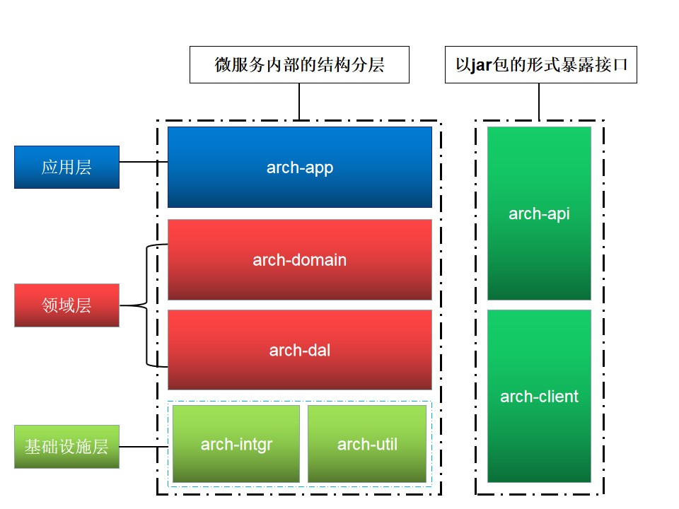
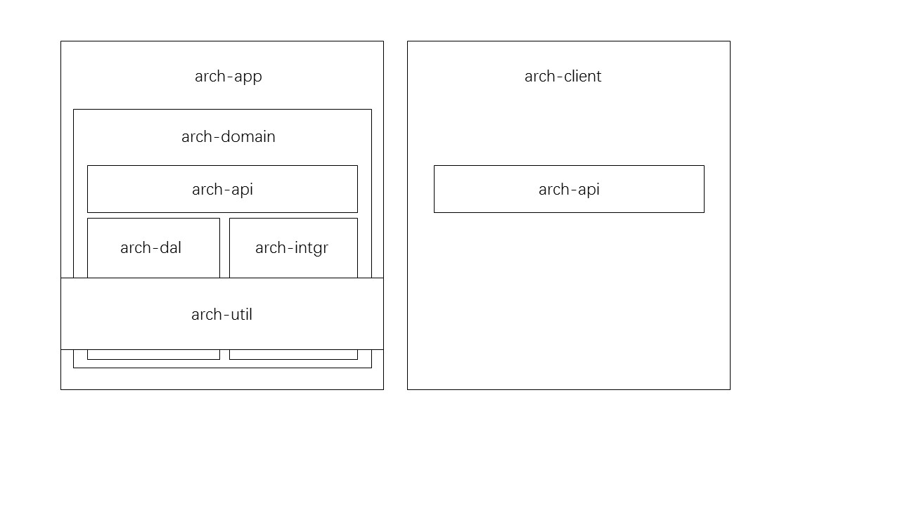

# 软件设计
本来是想写篇软件分层的文章，想想介绍的内容不单单是要阐述软件分层的思想。下面以一个具体的例子进入主题

## 骨架工程
骨架工程的目的是将软件开发过程中的最佳实践、可重用的代码引入到框架中，形成一套标准。方便他人能够快速的融入到团队的开发规范中，更快、更有效的开发代码，将精力都集中在业务场景下的代码逻辑上，避免了不必要的分心。


### 名词解释
|  术语 |全称   |说明   |
|---|---|---|
| DTO  | Data Trafer Object  |   |
| DAO  |  Data Access Object |   |
| DO  |  Domain Object |   |
|app|application||
|intgr|integration||
|vo|value object||

### 目录结构
```
├── arch-app       # 包含了一系列@RestController
├── arch-domain    # 包含了一系列@Service和@Component和DO实体模型
├── arch-dal       # 包含了一系列@Mapper和DAO实体模型
├── arch-intgr     # 包含了一系列其他业务的xxx-client及第三方平台sdk的封装
├── arch-util      # 包含了一系列XXXUtils工具类
├── arch-api       # 包含了出入参的DTO实体模型以及API接口
└── arch-client    # 包含了一系列@FeignClient
```
### 结构图

打包时会将**arch-api**及**arch-client**部署到私服中，供其他业务使用方使用
* **arch-app** 引用了arch-api、arch-domain、arch-intgr，所有的@RestController都实现了arch-api定义的接口
* **arch-domain** 引用了arch-dal和arch-util
* **arch-client** 引用了arch-api

### 优化版本V1
1. arch-domain如何使用arch-api中的实体模型?

    可以从arch-api中分离出arch-api-bean， arch-domain引用arch-api-bean

2. arch-domain如何使用arch-app中的实体模型?
   
   arch-app引用了arch-api，理论上不会需要自定义实体。实际操作时并不需要把所有的接口都暴露给业务使用方，只暴露业务使用方需要的接口，所以arch-app中会存在实体模型。
   可以从arch-app中分离出arch-app-bean，arch-domain引用arch-app-bean

3. arch-client中如何提供扩展点给业务使用方做业务降级?
   通过Spring提供的ApplicationContext获取业务使用方自定义的降级对象
```java
@FeignClient(value = "xxx", path = "api/v1/xxx", fallbackFactory = XXXClientFallbackFactory.class)
public interface IXXXClient extends IXXXApi {
    @Override
    @RequestMapping(value = "xxxAction", method = RequestMethod.GET)
    ResponseEntityDTO<DemoRespDTO> xxxAction(@RequestParam(value = "name") String name);
}

@Component
public class XXXClientFallbackFactory  extends AbstractFallbackFactory<IXXXClient> {
    @Value("${xxx.xxxClientExtend}")
    private String xxxClientExtend;

    @Autowired
    ApplicationContext appContext;

    @Override
    public IXXXClientClient createCustomObject() {
        if (appContext != null){
            if (StringUtils.isNotBlank(xxxClientExtend)){
                return  (IXXXClientClient) appContext.getBean(xxxClientExtend);
            }

        }
        return null;

    }
}

@Slf4j
public abstract  class AbstractFallbackFactory<T> implements FallbackFactory<T> {

    public abstract T createCustomObject();

    @Override
    @SuppressWarnings("unchecked")
    public T create(Throwable cause) {

        T obj = createCustomObject();
        if (obj != null){
            return obj;
        }

        return (T) Proxy.newProxyInstance(
                getEntityClass().getClassLoader(),
                new Class[] { getEntityClass() }, new FeignExceptionHandler(cause));
    }

    private Class getEntityClass() {
        Class clazz = getClass();
        Type type = clazz.getGenericSuperclass();
        ParameterizedType p = (ParameterizedType)type;
        return (Class) p.getActualTypeArguments()[0];
    }


    class FeignExceptionHandler implements InvocationHandler {

        private Throwable cause;

        FeignExceptionHandler(Throwable cause) {
            this.cause = cause;
        }

        @Override
        public Object invoke(Object proxy, Method method, Object[] args) {
            log.error("invoke failed, error message:{}", cause.getMessage());
            return ResponseEntityDTO.failure(ResponseCode.FAILED);
        }
    }
}


```
   
> **Tips:** 
> - 优化版本V1 在原来的基础上多增加了两层结构：arch-api-bean和arch-app-bean，使得骨架显得臃肿。能不能抽取出arch-bean，用于放置各种类型的bean？
> - 创建扩展点对象是arch-client的职责吗？
>
>这两个问题留给读者思考，如有疑问请通过文末的[联系方式](#联系方式)与我沟通

### 优化版本V2
1. 调整模型的依赖结构，优化[优化版本V1](#优化版本v1)中的优化点1、2，调整后的结构见下图

```
├─arch-app
├─arch-domain
│  ├─model
│  │  ├─converter # 用于存放实体模型转换
│  │  ├─do        # 领域实体模型，提供本领域内业务的方法
│  │  └─vo        # 值实体模型
│  └─service      # 轻service，内部调用do对象及repo完成业务逻辑
│      └─facade   # 封装多个service的复杂操作
├─arch-dal
│  ├─model
│  └─repo         # 封装数据访问层的增删改查的操作
├─arch-intgr
│  ├─facade       # 第三方接口出入参适配层
│  └─model        # 用于存放第三方实体模型
├─arch-utils
├─arch-api
│  └─model
└─arch-client
```
> **Tips:**
> - arch-app中@RestController下的接口实现arch-api包下的API接口。
> - arch-domain中service包下的接口继承自arch-api包下的API接口。为什么要继承API接口？这个问题留给读者思考，如有疑问请通过文末的[联系方式](#联系方式)与我沟通
> - arch-api接口方法中加入@RequestMapping、@RequestBody、@RequestParam，避免arch-client和arch-app做相同的操作
> - arch-util放在总的pom中，横跨arch-dal、arch-intgr、arch-domain、arch-app

1. 调整arch-client中扩展点的代码，优化[优化版本V1](#优化版本v1)中的优化点3，调整后的代码如下
```java
@Component
public class XXXClientFallbackFactory extends GenericFallbackFactory<IXXXApi> {
    public XXXClientFallbackFactory(){}
    public XXXClientFallbackFactory(IXXXApi xxxApi){super(xxxApi);}
}

@Slf4j
public  class GenericFallbackFactory<T> implements FallbackFactory<T> {
    public GenericFallbackFactory(){}
    public GenericFallbackFactory(T extend){this.extend = extend;}
    

    protected   T extend;
    
    @Override
    @SuppressWarnings("unchecked")
    public T create(Throwable cause) {
        log.trace("fallback due to:{}", cause.getMessage(), cause);
        if (extend != null){
            log.debug("switch to extend fallback:{}", extend.getClass().getName());
        }
        return extend;
    }

}

public class ResponseEntityDTO<T> implements Serializable {
    private static final long serialVersionUID = -8567541939288898127L;
    public static final ResponseEntityDTO SUCCEED = new ResponseEntityDTO(ResponseCode.SUCCEED);
    public static final ResponseEntityDTO FAILED = new ResponseEntityDTO(ResponseCode.FAILED);
    
    public static <T> boolean successAndDataNotNull(ResponseEntityDTO<T> resp){
        return success(resp) && resp.data != null;
    }
    public static <T> boolean success(ResponseEntityDTO<T> resp){
        return resp == null ? false:resp.succeed();
    }
    public static <T> ResponseEntityDTO<T> safeWrap(ResponseEntityDTO<T> resp){
        return resp==null?FAILED: resp;
    }

    T data;
    String message;
    Integer errCode;

    public boolean succeed() {
        return errCode==0;
    }
    
    public ResponseEntityDTO(ResponseCode code){
        message = code.getMessage();
        errCode = code.getCode();
    }
    // 此处省略其他代码
}

```
> **Tips:**
> - 将创建拓展点的任务交给业务使用方，业务使用方使用@Bean告知Spring如何构建对象，并将拓展的xxxApi传入到XXXClientFallbackFactory对象中
> - 实现FallbackFactory接口的目的只是为了知晓请求失败的原因，比如：服务down机、网络超时等，所以GenericFallbackFactory中只要记录下日志就可以了
> - 当业务使用方提供了拓展点，则使用业务方提供的拓展点，否则不会做任何处理。为什么不在GenericFallbackFactory中构造新的对象从而在方法中返回默认的返回体？这个问题留给读者思考，如有疑问请通过文末的[联系方式](#联系方式)与我沟通
> - 通过ResponseEntityDTO中的success、successAndDataNotNull对arch-client返回体做校验，safeWrap用于arch-app层，包装arch-domain层的返回体


### 优化版本V3
* 目前的骨架都是通过写好的模板，提供出去。可以通过一种自由的方式让用户去选择想要生成的骨架及使用的组件等。读者可以参考[Aliyun Java Initializer](https://start.aliyun.com/)的实现
* 针对不同的业务提供不同的骨架
* [优化版本V2](#优化版本v2)的方式能够满足单一技术栈的诉求，但是对于多技术栈显得无力。[优化版本V2](#优化版本v2)的方式本质上还是基于契约编程。可以从文档契约上去思考，
定义接口无非是定义好接口的出入参以及方法名。这块可以基于[openapi](https://www.openapis.org/)去做，当接口定义完毕可发布时。接口的使用方，可以在接口文档的平台中生成各自技术栈的基于当前文档库版本号对应的库，再细化的可以生成当前技术栈使用的框架(spring cloud、dubbo、grpc等)对应的库(lib、dll、jar等)
* 往往规范的出发点都是好的，如何保证使用骨架的人按照规范去执行？可以通过提供各种ide(vscode、idea等)插件，去提示用户。即使提示了，用户还是没有执行。这时可以通过骨架质检平台，扫描接入骨架的业务代码库，定期做质检分析。这块可以基于[archunit](https://www.archunit.org/)去做
* 此处留给读者思考，如果你有其他好的想法，请通过文末的[联系方式](#联系方式)与我沟通


### 结语
> - 不断的优化设计，是为了使用的人能够更高效并快乐的工作
> - 所有的软件设计并不是一蹴而就的
> - 软件是要分层的，但也要注意粒度。比较的典型的案例:TCP/IP VS OSI/RM
> - 一个好的软件设计者，一定是一个好的产品设计者
> - 软件的设计最终一定要形成闭环
> - 软件的设计是基于特定的业务使用场景的

今天是母亲节，祝天下所有的母亲节日快乐!

### 联系方式
 * 欢迎订阅我的公众号，这里主要会发表些软件工程上的一些想法及实践
