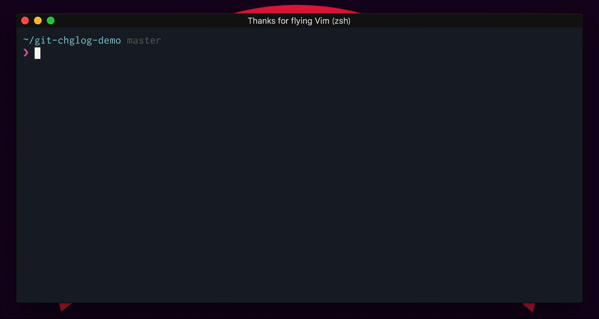
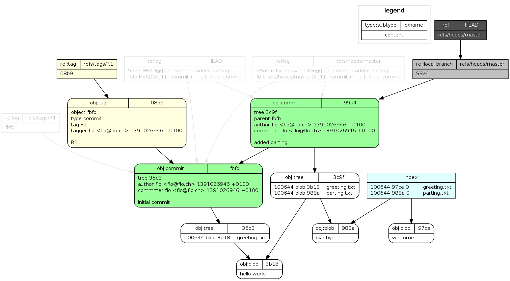

# Git工程实践

在[2015年12月8号](https://api.github.com/users/lokiworks)的时候，注册了github。正是通过github接触了git，那时对于我而言，只是觉得从一个[svn工具](https://tortoisesvn.net/)切换到另外一个[git工具](https://tortoisegit.org/)，使用上并无太大的差别。后期使用的过程中踩过一些坑，通过官方的教程，学习了git内部的原理，通过做实验慢慢的加深了对git的理解。这里将一些经验上的总结、实践分享出来，希望能够帮助各位在git的学习之路上少走些弯路。

## 主要特性

- **基于快照的版本管理**

1. 本地搭建实验环境，新建一个空的文件夹test，在该目录下初始化空的git项目。

   ```sh
   mkdir test; cd test; git init
   ```

2. 新建h.txt，将hello world写入到h.txt中

   ```shell
   echo 'hello world' >> h.txt
   ```

3. 添加文件并提交代码

   ```shell
   git add .; git commit -m 'feat: add h.txt'
   ```

4. 追加hello world到h.txt中

   ```shell
   echo 'hello world' >> h.txt
   ```

5. 提交代码

   ```shell
   git commit -am 'feat: modify h.txt'
   ```

6. 查看文件h.txt的提交记录

   ```shell
   git log --pretty=oneline h.tx
   # 日志展示的内容如下：
   # 7fa1b21d9b0defe1c2feb8be7bfc3e662bcc31a9 (HEAD -> master) feat: modify h.txt
   # aa56da444f61cec3a80e231c8b9d66cd75dd8f2b feat: add h.txt
   ```

7. 查看h.txt第二次提交的文件内容

   ```shell
   git cat-file -p 7fa1b21d9b0defe1c2feb8be7bfc3e662bcc31a9# commit hash
   git cat-file -p bb0ae28448e6c19fdbe294df1a518edd92cdf7f8# tree hash
   git cat-file -p 10bda51843e912c86901eea164d0b3f7c9a56df3# blob hash
   # h.txt文件的内容
   # hello world
   # hello world
   
   ```

   

8. 查看h.txt第一次提交的文件内容

   ```shell
   git cat-file -p aa56da444f61cec3a80e231c8b9d66cd75dd8f2b# commit hash
   git cat-file -p 5ee620adb265fa7cb43f76e641da23cec27cd4d9# tree hash
   git cat-file -p 3b18e512dba79e4c8300dd08aeb37f8e728b8dad# blob hash
   # h.txt文件的内容
   # hello world 
   ```

   通过上述几步的实验操作，可以加深对git快照特性的理解。这里留个任务给各位

   > 新建一个空的git项目，添加一个50M左右的文件并提交，之后在该文件的末尾出新增一行记录并提交。根据git快照的特性，两次提交后，总的大小应该大于等于100M，通过命令`du -sh <git项目名>`查看该项目总的大小 ，是否跟你想的一样？如果不是，git是如何处理的。

* **可离线开发**

  这是git区别svn的主要特性之一，通过`git help`列出常用的命令。

  ```shell
  These are common Git commands used in various situations:
  
  start a working area (see also: git help tutorial)
     clone             Clone a repository into a new directory
     init              Create an empty Git repository or reinitialize an existing one
  
  work on the current change (see also: git help everyday)
     add               Add file contents to the index
     mv                Move or rename a file, a directory, or a symlink
     restore           Restore working tree files
     rm                Remove files from the working tree and from the index
     sparse-checkout   Initialize and modify the sparse-checkout
  
  examine the history and state (see also: git help revisions)
     bisect            Use binary search to find the commit that introduced a bug
     diff              Show changes between commits, commit and working tree, etc
     grep              Print lines matching a pattern
     log               Show commit logs
     show              Show various types of objects
     status            Show the working tree status
  
  grow, mark and tweak your common history
     branch            List, create, or delete branches
     commit            Record changes to the repository
     merge             Join two or more development histories together
     rebase            Reapply commits on top of another base tip
     reset             Reset current HEAD to the specified state
     switch            Switch branches
     tag               Create, list, delete or verify a tag object signed with GPG
  
  collaborate (see also: git help workflows)
     fetch             Download objects and refs from another repository
     pull              Fetch from and integrate with another repository or a local branch
     push              Update remote refs along with associated objects
  
  'git help -a' and 'git help -g' list available subcommands and some
  concept guides. See 'git help <command>' or 'git help <concept>'
  to read about a specific subcommand or concept.
  See 'git help git' for an overview of the system.
  ```

  上面的命令除了`clone`、`fetch`、`pull`、`push`，其他的命令都可在本地完成操作。

  

## 经验总结

* **慎用GitLab中的冲突解决**， 除非你知道它的命令组合

  ```shell
  git checkout "source branch"
  git merge "target branch"
  ```

* **只在属于自己的分支中执行rebase**，否则只会将提交历史变的更加混乱
* **慎用revert**，除非你知道revert是在原有的基础上做了相反的操作。如果恢复的话，需要执行 revert revert操作

## 工程实践

### 实用工具

* [git commit hook](https://github.com/tommarshall/git-good-commit) 通过hook做一些事前检查，比如检查提交是否符合Angular规范

* [changelog生成器](https://github.com/git-chglog/git-chglog) 配合自动化工作流，自动生成changelog

* [rewrite history](https://github.com/newren/git-filter-repo) 可以用来更改邮箱地址、删除大文件、拆分目录等
* [draw image ](https://github.com/sensorflo/git-draw) 通过绘制图形的方式，可视化的展示了git内部的结构


### 分支策略

关于分支模型最理想的模式为**trunk based development**，实际使用过程中很少有团队能够做到。实践过程中比较好的分支模型：[Aoneflow](http://bos.itdks.com/7b7b1baa2f1244b8b3c2b3ae26de3eea.pdf)，通过将多个特性分支，合成一个release的方式，实现“准持续集成”

### 回退流程

日常开发过程中，有时不小心会污染了**Master**或者**Main**分支。此时需要一种方式来回滚代码

1. gitlab中将**Master**或**Main**分支改成非默认分支
2. 删除**Master**或**Main**分支
3. 从当前稳定的分支中拉出一个全新的 **Master**或**Main**分支
4. 将**Master**或**Main**分支设置为默认分支

### 权限管理

代码作为软件企业的核心资产，核心的算法及设计方案作为核心中的核心，只允许少部分人有权限查看，这时就需要权限上的管控。git本身提倡的是开放，权限管理不是它的强项，需要借助hook实现。git无法做到目录级别的权限管控，需要将目录拆成单独的项目。gitlab中提供了几类角色(访客、报告者、开发者、管理者)，让我奇怪的是为啥gitlab不实现**rbac**（如果有的话，应该是个亮点），实际企业内部开发的过程中可能不止这些角色。对于多角色的使用场景，实际操作过程中可以给开发者授予**访客**的角色，研发负责人授予**开发者**的角色，运维负责人授予**管理者**的角色。

### 评审机制

* **基于提交** 如果对代码的质量有较高的标准并且团队所有成员都认同该方式，可以考虑引入gerrit
* **基于分支合并** 在合并分支代码的时候，完成代码的审查。一种较宽松的方式，也是我觉得企业内部可推行的方式。

大概在2020年9月份的时候，读到了蒋鑫先生的文章[AGit-Flow 阿里巴巴集中式 Git 工作流](https://git-repo.info/zh_cn/2020/03/agit-flow-and-git-repo/)，蒋先生列的几点特征

1. 仓库的授权模型简单。无需为项目设置复杂的授权，只读用户亦可参与代码贡献。
2. 通过代码评审提升代码质量。参与者不是将代码直接推送的分支上，而是创建代码评审。
3. 仓库的分支模型简单。仓库中没有多余的分支，即不需要创建特性分支。

一方面能够解决了**分支策略**中多分支的问题，另一方面也解决了**权限管理**中权限的问题。在[git2.29版本](https://developer.aliyun.com/article/776452)已包含蒋先生文章中的***proc*-receive **。目前阿里云的云效已实现该特性，感兴趣的可以试试。gitlab目前还没有该功能，自己集成的话，蒋先生提供了一些思路。(https://github.com/alibaba/git-repo-go/issues/3)

### 单体仓库

* **CODEOWNERS** 通过维护一份 **CODEOWNERS**文件说明目录空间由哪个团队或个人负责，任何该目录空间下文件的更改，都将由代码的拥有者审核
* **sparse-checkout** 只检出需要的目录，具体可以看这篇文章(https://github.blog/2020-01-17-bring-your-monorepo-down-to-size-with-sparse-checkout/)
* **git log --pretty=oneline -- <目录名>** 查看某一目录下的提交日志
* **git tag -a <目录名>/vx.x.x -m '<说明内容>'** 给目录下的变更打上标签
* **scalar** 提升超大型单体仓库的速度，具体可以看这篇文章(https://devblogs.microsoft.com/devops/introducing-scalar/)
* **bazel** 单体仓库下的构建利器，具体可以看官方的介绍(https://bazel.build/)